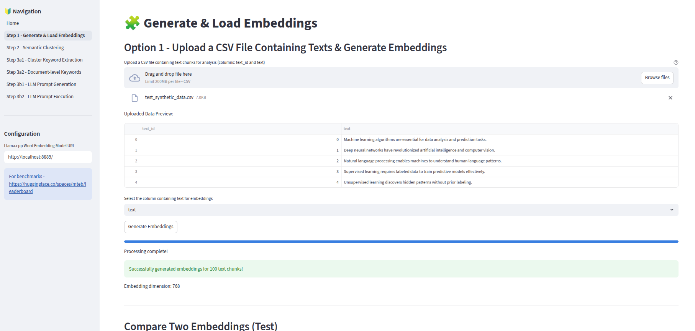
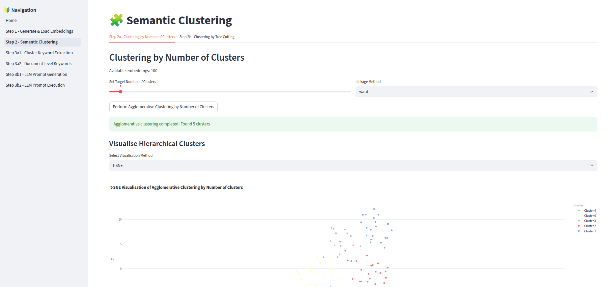
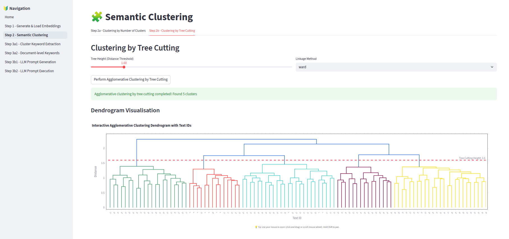
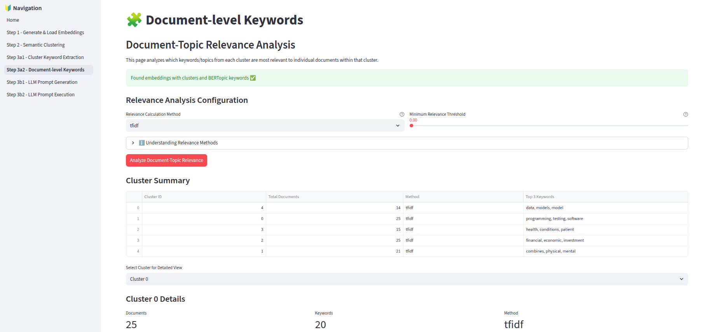
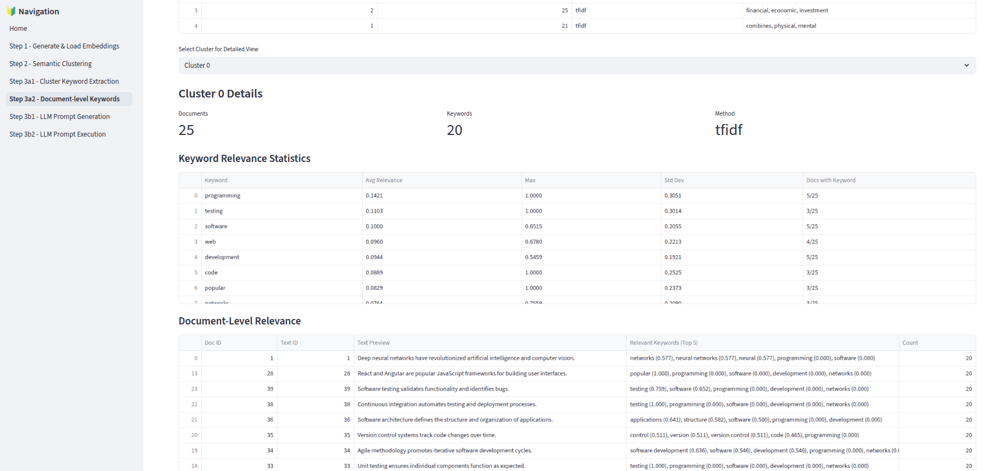
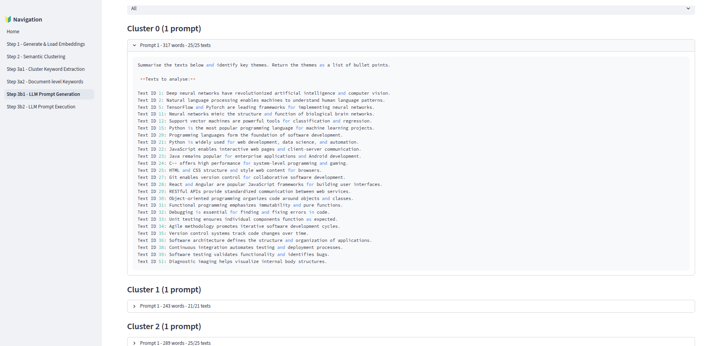
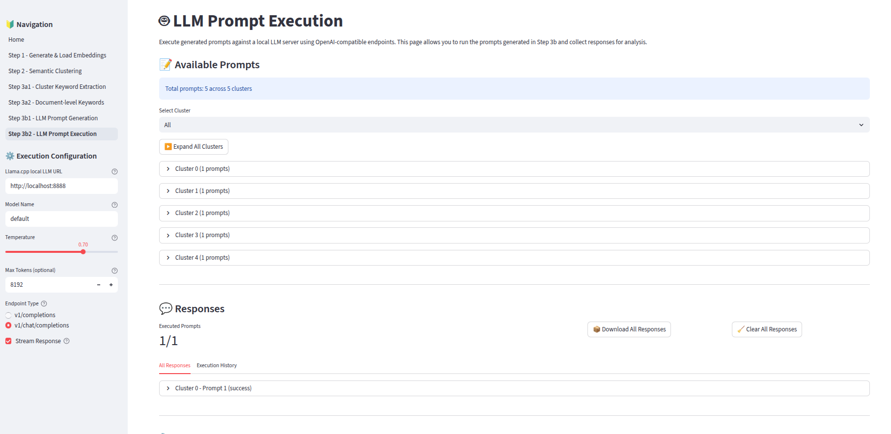
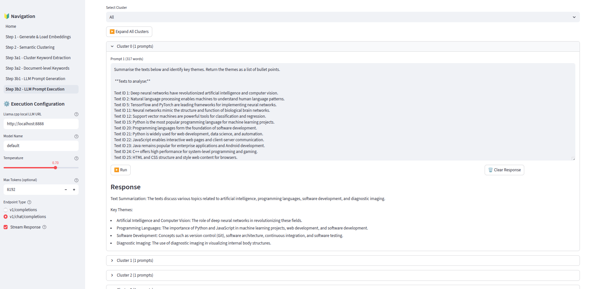

# Semantic Clustering & Keyword Extraction App

This Streamlit application extracts insights from unstructured text. It leverages word embeddings, semantic clustering (using reproducible Agglomerative methods), and BERTopic-style keyword extraction to help analyse and categorise large text datasets.

The application is designed to work with a local Large Language Model (LLM) hosted using **Llama.cpp** server for privacy-preserving, offline-capable word embedding generation and prompt execution.

## Features

*   **Data Management**: Upload CSVs, generate embeddings locally using Llama.cpp, and manage datasets.
*   **Semantic Clustering**: Group similar text chunks using hierarchical agglomerative clustering. Visualise results with interactive PCA/t-SNE scatter plots and dendrograms.
*   **Keyword Extraction**: Extract representative keywords for each cluster using BERTopic-style c-TF-IDF.
*   **Document Analysis**: Score document relevance to cluster keywords.
*   **LLM Prompt Generation**: Generate prompts for user to paste into LLMs (like Microsoft Copilot) for cluster summarisation and insight generation.
*   **LLM Prompt Execution**: Execute the generated prompts locally using any open-weight LLM hosted via Llama.cpp’s llama-server.

---

## Setup Instructions

### 1. Prerequisites

Ensure you have the following installed:

*   **uv** (Python Package Manager):
    *   MacOS/Linux: `curl -LsSf https://astral.sh/uv/install.sh | sh`
*   **Llama.cpp**: You need the `llama-server` application to serve the open-weight word embedding and language models. More information can be found here: https://github.com/ggml-org/llama.cpp
    *   [Download pre-built binaries](https://github.com/ggml-org/llama.cpp/releases) or build from source.

### 2. Installation

Clone the repository and set up the Python environment using `uv`:

```bash
# Clone the repository
git clone https://github.com/joe-zlu/semantic_clustering_app_public.git
cd semantic_clustering_app_public

# Sync dependencies (creates virtual environment)
uv sync
```

### 3. Model Deployment (Llama.cpp)

The application requires running Llama.cpp servers. You may need two different models depending on the task:
1.  **Word Embedding Model**: For generating vector representations of text (Step 1).
2.  **LLM (Chat Model)**: For executing analysis prompts (Step 3 Option 2).

#### A. Deploying the Embedding Model (Required for Step 1)
Download a dedicated word embedding model that is supported by Llama.cpp (i.e. model in GGUF format). You can find open-weight models on Huggingface (https://huggingface.co/models). The example below uses Google's Gemma 300 million parameter word embedding model (https://huggingface.co/google/embeddinggemma-300m).

```bash
# Run on port 8889 (Default in app)
./llama-server --model ~/GGUF/embedding/embeddinggemma-300M-Q8_0.gguf --port 8889 --embedding --ctx-size 8192
```
*   `--embedding`: **Critical** flag to enable the embedding endpoint.
*   `--ctx-size`: Ensure this is larger than your longest text chunk.

#### B. Deploying the LLM for Prompt Execution (Required for Step 3 Option 2)
Download an open-weight LLM. (e.g. IBM's Granite 4.0 H-Tiny https://huggingface.co/ibm-granite/granite-4.0-h-tiny).

```bash
# Run on a different port (e.g., 8888) to keep both active
./llama-server --model ~/GGUF/granite-4.0-h-tiny-UD-Q6_K_XL.gguf --port 8888 --ctx-size 16384
```

### 4. Running the Application

Once the environment is synced and your model server(s) are running, start the Streamlit app:

```bash
source .venv/bin/activate
streamlit run app.py
```

Open your browser to the URL displayed (usually `http://localhost:8501`).

---

## How to Use

The application follows a linear workflow accessible via the sidebar.

### Step 1: Data Management
*   **Configure Server**: Enter the URL of your **Embedding** server (e.g., `http://localhost:8889`).
*   **Upload Data**: Upload a CSV file containing your text data. It must have:
    *   `text` column: The content to analyze.
    *   `text_id` column: A unique identifier for each row.
*   **Generate Embeddings**: Select the text column and click "Generate Embeddings".
*   **Save/Load**: Save embeddings to disk or reload them later.

### Step 2: Semantic Clustering
*   **Choose Method**:
    *   **By Number of Clusters**: Specify an exact number (e.g., 5 clusters).
    *   **By Distance Threshold**: Cut the dendrogram at a specific height for natural grouping.
*   **Visualise**: Explore the 2D scatter plot to see how your texts group together.

### Step 3 Option 1: Keyword Extraction
*   **Extract**: Use c-TF-IDF to find words that define each cluster.
*   **Refine**: Adjust parameters (Top N, N-gram range) to clean up keywords.
*   **Review**: See which keywords characterize each group.

### Step 3 Option 1: Document-level Keywords (Optional)
*   **Analyze**: Score individual documents against their cluster's keywords.
*   **Filter**: Identify outliers or strongly aligned documents.

### Step 3 Option 2: Analyse using an LLM - Prompt Generation
*   **Generate**: Write an instruction (e.g. "Summarise the key themes") for analysing each cluster of texts. The app bundles the instruction and the cluster texts into prompts suitable for a given LLM context windows. Overly long prompts are broken into smaller prompts.
*   **Export**: Download the prompts as text files or copy to clipboard.

### Step 3 Option 2: Analyse using an LLM - Prompt Execution
*   **Configure Server**: Enter the URL of your local **Chat/LLM** server endpoint (e.g. `http://localhost:8888`).
*   **Execute**: Run the generated prompts against the local LLM.
*   **Review**: View responses in real-time and download the analysis results.

## Screenshots

### Step 1: Data Management



### Step 2: Semantic Clustering






### Step 3 Option 1: Keyword Extraction






### Step 3 Option 2: Analyse using an LLM - Prompt Generation




### Step 3 Option 2: Analyse using an LLM - Prompt Execution




